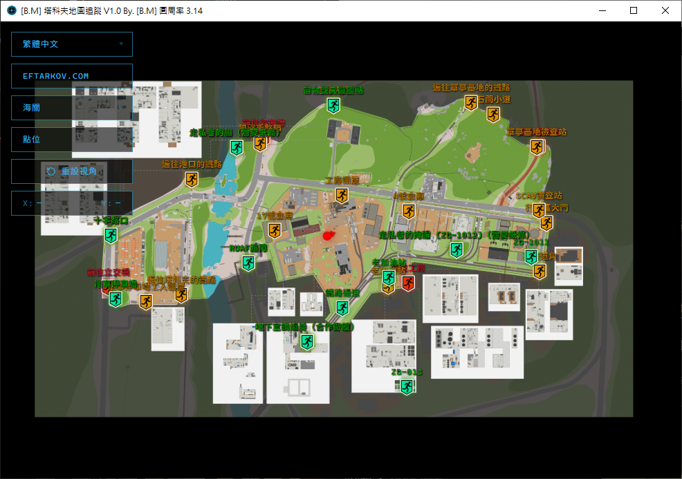

# [B.M] 塔科夫地圖追蹤

[](#系統需求)
[](https://go.dev/)
[](https://v3.wails.io/)
[](https://github.com/BoringMan314/bm-tarkov-map-tracker)
[](https://github.com/BoringMan314/bm-tarkov-map-tracker/releases)

Windows 桌面版《Escape from Tarkov》互動地圖工具，支援 **tarkov.dev（衛星圖 / 抽象圖）** 與 **eftarkov.com** 三種資料來源，可顯示撤離點、轉移點、滑鼠遊戲座標與多語系介面。

*Windows 桌面版《逃离塔科夫》互动地图工具，支持 **tarkov.dev（卫星图 / 抽象图）** 与 **eftarkov.com** 三种数据源，可显示撤离点、转移点、鼠标游戏坐标与多语言界面。*

*Windows 向け『Escape from Tarkov』インタラクティブマップ。**tarkov.dev（衛星図 / 抽象図）** と **eftarkov.com** の 3 データソース、撤离・Transit ポイント、マウス座標、多言語 UI に対応。*

*An interactive Escape from Tarkov map tracker for Windows with tarkov.dev (satellite / abstract) and eftarkov.com data sources, exfil/transit markers, mouse game coordinates, and multilingual UI.*

> **聲明**：本專案為第三方輔助工具，地圖與點位資料來自 [tarkov.dev](https://tarkov.dev/) 與 [eftarkov.com](https://api.eftarkov.com/)。請遵守遊戲與各資料來源之使用規範。

---
## 該專案尚在開發，歡迎提交 Pull requests



---

## 目錄

- [功能](#功能)
- [系統需求](#系統需求)
- [安裝與打包](#安裝與打包)
- [檢查流程（建議）](#檢查流程建議)
- [本機開發與測試](#本機開發與測試)
- [技術概要](#技術概要)
- [專案結構](#專案結構)
- [設定檔與多語系](#設定檔與多語系)
- [地圖資料更新（選用）](#地圖資料更新選用)
- [隱私說明](#隱私說明)
- [問題與建議](#問題與建議)

---

## 功能

- 三種資料來源切換：
  - **tarkov.dev（衛星圖）**：`maps/*_tarkov.dev_A.png`
  - **tarkov.dev（抽象圖）**：`maps/*_tarkov.dev_B.svg`（無 SVG 時用 `.png`）
  - **eftarkov.com**
- 支援地圖：工廠、中心區、立交橋、燈塔、實驗室、海關、海岸線、迷宮、儲備站、森林、塔科夫街區等（依 catalog 為準）。
- 撤離點圖層：PMC / SCAV / 合作 / 轉移，可個別開關與顯示名稱。
- 地圖縮放、拖曳、重設視角；滑鼠 X / Y 遊戲座標顯示。
- 內建語言：繁體中文、簡體中文、日本語、English；可於 `bm-tarkov-map-tracker.json` 擴充其他語系。
- 系統匣：
  - 左鍵還原主視窗至約 `100,100`
  - 右鍵選單：**GitHub**、關於、離開
- 防多開：後開會結束前開實例（含 exe 改名／複製情境）。
- 視窗標題格式：`[B.M] 塔科夫地圖追蹤 V0.1 By. [B.M] 圓周率 3.14`（產品名依語系 `project_name` 切換）。

---

## 系統需求

- **Windows 10 x64**（僅支援此平台；無 Win7 版）。
- **Microsoft Edge WebView2 Runtime**（Win10 通常已內建；若無法顯示地圖請先安裝）。
- 執行 Release 版：直接執行 `bm-tarkov-map-tracker.exe`，無需另裝 Go / Node。
- 自行建置時另需：
  - [Go 1.22+](https://go.dev/dl/)
  - [Wails v3 CLI](https://v3.wails.io/)：`go install github.com/wailsapp/wails/v3/cmd/wails3@latest`
  - Node.js（前端 `npm run build`）
  - Python 3.10+ + Pillow（僅更新內嵌地圖／點位時需要）

---

## 安裝與打包

### 安裝（使用 Releases）

1. 下載 [Releases](https://github.com/BoringMan314/bm-tarkov-map-tracker/releases) 的 `bm-tarkov-map-tracker.exe`。
2. 放到任意資料夾後直接執行。
3. 首次執行會在同目錄建立 `bm-tarkov-map-tracker.json`。

### Windows 10/11（本機建置）

```bat
build_win10.bat
```

輸出（專案**根目錄**）：

- `bm-tarkov-map-tracker.exe`

說明：

- 建置前會執行 `python tools\sync_root_assets.py`（僅在根目錄缺檔時從 `internal/` 補 seed；**不複製**到 internal）。
- `wails3 build` 中間產物位於 `bin/`，完成後複製至專案根目錄。
- **不會**在專案根目錄產生 `dist/` 資料夾；根目錄僅保留最終 exe。
- 地圖 PNG 與 bundle JSON 已內嵌於 exe；根目錄 `maps/`、`points/`、`icons/` 為唯一主檔（Go 透過 `embed.go` 直接 embed）。

---

## 檢查流程（建議）

1. 啟動後主視窗是否出現於第一螢幕約 `100,100`。
2. 切換 **tarkov.dev（衛星圖 / 抽象圖）** 與 **eftarkov.com**，各地圖是否能載入（非全黑）。
3. 工廠、海關、海岸線等曾調整座標的圖：撤離點是否落在合理位置。
4. 語言循環、`bm-tarkov-map-tracker.json` 讀寫是否正常。
5. 系統匣左鍵能否還原視窗；右鍵 GitHub／關於／離開是否正常。
6. 連續啟動兩次是否僅保留最後一個實例。
7. 滑鼠移動時 X / Y 是否隨地圖更新。

---

## 本機開發與測試

```bat
go mod tidy
cd frontend
npm install
npm run build
cd ..
wails3 dev
```

或使用專案 Taskfile（需已安裝 `wails3`）：

```bat
wails3 task windows:run
```

---

## 技術概要

- 桌面殼層：Go + [Wails v3](https://v3.wails.io/) + WebView2
- 前端：原生 JavaScript / CSS（`frontend/public/`）
- 地圖與點位：根目錄 `maps/`、`points/`、`icons/`（`embed.go` 直接 embed，無 internal 副本）
- 多語系：根目錄 `i18n/`（同上，直接 embed）
- HTTP API：內建 `http.Server` 提供 `/api/maps`、`/api/map/{id}` 等
- 設定檔：EXE 同層 `bm-tarkov-map-tracker.json`（首次啟動自動建立）

---

## 專案結構

| 路徑 | 說明 |
| --- | --- |
| `cmd/bm-tarkov-map-tracker/main.go` | 程式進入點、Wails 視窗與系統匣 |
| `embed.go` | 根目錄資源 embed（`maps/`、`points/`、`icons/`、`i18n/`、`frontend/public/`） |
| `build_win10.bat` | Win10 x64 建置腳本（根目錄產出 exe） |
| `icons/` | `icon.ico`（視窗／exe）、`icon.png`（系統匣） |
| `maps/` | 地圖主資料：`{地圖名}_tarkov.dev_A.json`、`_tarkov.dev_B.json`、`_eftarkov.com.json`（含 meta + 撤離點 `points`）及對應 PNG/SVG；**手動改請改這裡** |
| `points/` | 撤離點／玩家圖示 PNG（`exfil-*.png`、`player.png`；`player.psd` 為設計稿）；**手動改圖請改這裡** |
| `i18n/` | 各語系 JSON（`zh_TW.json`…）與 `catalog.json`（含 key 數量） |
| `frontend/public/` | 前端頁面與靜態資源（`index.html`、`app.js`、`style.css`） |
| `internal/appmeta/` | 版本、視窗標題、GitHub URL |
| `internal/maps/` | 地圖 HTTP API、三資料來 catalog（tarkov.dev 衛星圖 / 抽象圖 / eftarkov.com → 根目錄 `maps/`） |
| `internal/points/` | 撤離點 ID 名稱（`exfil_names.json`、`eftarkov_names.json`，供 i18n 注入 `exfil_*` key） |
| `internal/i18n/` | 多語系載入邏輯（`load.go`、`exfil.go`） |
| `tools/` | Python 地圖／點位同步腳本 |
| `screenshot/` | README 展示截圖 |
| `Exe.txt` | 需求與規格備忘 |

---

## 設定檔與多語系

- 設定檔：`bm-tarkov-map-tracker.json`（與 exe 同層）。
- `settings.languages`：目前使用語系代碼（如 `zh_TW`）。
- 根層 `languages`：各語系翻譯物件；鍵集須與內建 `zh_TW` 一致，否則程式會覆寫為內建預設。
- 內建字串來源：根目錄 **`i18n/`**（每語系一個 `<code>.json`，檔案開頭含 `_meta` 定義顯示名稱）。
- 新增語言：複製 `i18n/en_US.json` → `i18n/<新代碼>.json`，修改 `_meta`，再執行 `python tools/sync_root_i18n.py`（會自動併入 catalog、補缺 key、注入撤離點名稱）。
- 繁中／簡中：`zh_TW.json`、`zh_CN.json` 的 UI 與 **`exfil_*` 撤離點名稱** 已自 `internal/points/exfil_names.json`、`eftarkov_names.json` 注入對應翻譯；其餘語系缺譯時 fallback 英文。
- 視窗標題產品名僅使用 **`project_name`**（與 `[B.M] … V0.1 By. [B.M] 圓周率 3.14` 前後綴組合）。

### 語系檔格式範例

```json
{
    "_meta": {
        "code": "zh_TW",
        "language_name": "繁體中文"
    },
    "project_name": "塔科夫地圖追蹤",
    "exfil_<id>": "3號門"
}
```

### 語系 KEY 數量（`i18n/catalog.json`）

| 語系 | KEY 數 | 語系 | KEY 數 |
| --- | ---: | --- | ---: |
| zh_TW | 345 | ko_KR | 345 |
| zh_CN | 345 | cs_CZ | 345 |
| en_US | 345 | fr_FR | 345 |
| ja_JP | 345 | de_DE | 345 |
| hu_HU | 345 | it_IT | 345 |
| pl_PL | 345 | pt_PT | 345 |
| sk_SK | 345 | es_ES | 345 |
| es_MX | 345 | tr_TR | 345 |
| ru_RU | 345 | ro_RO | 345 |
| vi_VN | 345 | id_ID | 345 |
| th_TH | 345 | | |

共 **21** 語系，每語系 **345** 個 key（含 UI、地圖名、`exfil_*` 撤離點名稱等）。重新統計：`python tools/sync_root_i18n.py`

---

## 地圖資料更新（選用）

地圖與點位**不**在每次建置時從網路更新。維護者可用 `tools/` 同步腳本更新 `internal/`，再**初次匯出**至根目錄；之後以根目錄 `maps/*.json` 為準，建置不會覆寫。

```bat
python tools\sync_markers_from_tarkovdev.py
python tools\sync_dev_maps_all.py
python tools\sync_points_from_eftarkov.py
python tools\sync_maps_from_eftarkov.py
python tools\sync_root_assets.py
python tools\sync_root_i18n.py
```

**主檔命名**：`maps\{地圖名}_tarkov.dev_A.json`（例：`customs_tarkov.dev_A.json`），同目錄另有 `_tarkov.dev_B.json`、`_eftarkov.com.json` 及對應 PNG/SVG。手動改撤離點請編輯這些 JSON 的 `points` 欄位。

`sync_root_assets.py`：根目錄 **`maps/`、`points/`、`icons/`** 為主檔；僅在根目錄缺檔時才從 `internal/` 建立。`sync_root_i18n.py` 維護根目錄 `i18n/`。建置時 Go 讀取根目錄這些資料夾（`embed.go`），**不再**複製到 `internal/assets/`。`build_win10.bat` 建置前仍會執行這兩個 sync 腳本。

單圖腳本範例：`sync_factory_from_tarkovdev.py`、`sync_shoreline_from_tarkovdev.py`、`sync_customs_from_tarkovdev.py` 等（詳見 `tools/`）。

---

## 隱私說明

本工具為本機端執行程式，預設僅在本機讀寫同目錄設定檔（`*.json`），**不蒐集、不上傳**個人資料或使用行為資料。

目前程式僅有以下外部互動：

- 使用者在系統匣選單點擊「關於」時，會開啟 `http://exnormal.com:81/`。
- 使用者在系統匣選單點擊 **GitHub** 時，會開啟本倉庫頁面。
- 維護者執行 `tools/` 同步腳本時，會向 tarkov.dev / eftarkov.com 等來源下載公開地圖資料。

---

## 問題與建議

歡迎使用 [GitHub Issues](https://github.com/BoringMan314/bm-tarkov-map-tracker/issues) 回報錯誤或提出建議（請附上 Windows 版本、資料來源（tarkov.dev 衛星圖 / 抽象圖 / eftarkov.com）、地圖名稱、重現步驟與截圖）。